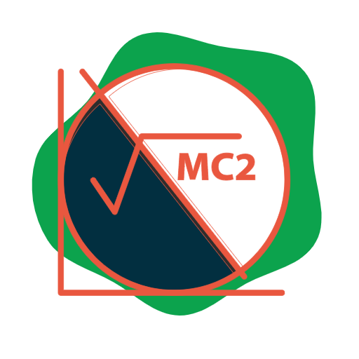

<a name="readme-top"></a>

<div align="center">

  
  <br/>

  <h3><b>Math Magicians</b></h3>

</div>

<!-- TABLE OF CONTENTS -->

# 📗 Table of Contents

- [📖 About the Project](#about-project)
  - [🛠 Built With](#built-with)
    - [Tech Stack](#tech-stack)
    - [Key Features](#key-features)
  <!-- - [🚀 Live Demo](#live-demo) -->
- [💻 Getting Started](#getting-started)
  - [Prerequisites](#prerequisites)
  - [Setup](#setup)
  - [Install](#install)
  - [Usage](#usage)
  - [Run tests](#run-tests)
  - [Deployment](#deployment)
- [👥 Authors](#authors)
- [🔭 Future Features](#future-features)
- [🤝 Contributing](#contributing)
- [⭐️ Show your support](#support)
- [🙏 Acknowledgements](#acknowledgements)
- [❓ FAQ (OPTIONAL)](#faq)
- [📝 Attribution](#attribution)
- [📝 License](#license)

<!-- PROJECT DESCRIPTION -->

# 📖 Math Magicians <a name="about-project"></a>

>Math magicians is a website for all fans of mathematics. It is a Single Page App (SPA) that allows users to:Make simple calculations.Read a random math-related quote.


## 🛠 Built With <a name="built-with"></a>

### Tech Stack <a name="tech-stack"></a>


<details>
  <summary>Client</summary>
  <ul>
    <li><a href="https://reactjs.org/">React.js</a></li>
  </ul>
</details>

<details>
  <summary>Server</summary>
  <ul>
    <li><a href="https://expressjs.com/">Express.js</a></li>
  </ul>
</details>

<details>
<summary>Database</summary>
  <ul>
    <li><a href="https://www.postgresql.org/">PostgreSQL</a></li>
  </ul>
</details>

<!-- Features -->

### Key Features <a name="key-features"></a>

> **Project Setup**- React and Linters

<p align="right">(<a href="#readme-top">back to top</a>)</p>

<!-- LIVE DEMO -->

<!-- ## 🚀 Live Demo <a name="live-demo"></a>


- [Live Demo Link](https://google.com)

<p align="right">(<a href="#readme-top">back to top</a>)</p> -->

<!-- GETTING STARTED -->

## 💻 Getting Started <a name="getting-started"></a>

> To get a local copy up and running, follow these steps.


### Prerequisites

In order to run this project you need:


### Setup

Clone this repository to your desired folder:


```sh
cd my-folder
git clone https://github.com/RileyManda/match-magicians.git
```


### Install

Install this project with:


```sh
  cd my-project
  npm i
```


### Usage

To run the project, execute the following command:


```sh
  npm start
```


### Run tests

To run tests, run the following command:


```sh
  npm test
```


### Deployment

You can deploy this project using:
    
```sh
    npm run build
```
 ```sh
    gh-pages deploy --dist build
```


<p align="right">(<a href="#readme-top">back to top</a>)</p>

<!-- AUTHORS -->

## 👥 Authors <a name="authors"></a>

👤 **RileyManda**

- GitHub: [@RileyManda](https://github.com/RileyManda)
- Twitter: [@rilecodez](https://twitter.com/rilecodez)
- LinkedIn: [rileymanda](https://www.linkedin.com/in/rileymanda/)


<p align="right">(<a href="#readme-top">back to top</a>)</p>

<!-- FUTURE FEATURES -->

## 🔭 Future Features <a name="future-features"></a>

> Describe 1 - 3 features you will add to the project.

- [ ] **[Perform Calculation]**
- [ ] **[Generate Quotes]**
- [ ] **[Project Ui Developement]**
- [ ] **[Ui Developement Improvements]**
- [ ] **[Application deployment]**

<p align="right">(<a href="#readme-top">back to top</a>)</p>

<!-- CONTRIBUTING -->

## 🤝 Contributing <a name="contributing"></a>

Contributions, issues, and feature requests are welcome!

Feel free to check the [issues page](https://github.com/RileyManda/math-magicians/issues).

<p align="right">(<a href="#readme-top">back to top</a>)</p>

<!-- SUPPORT -->

## ⭐️ Show your support <a name="support"></a>


If you like this project...

<p align="right">(<a href="#readme-top">back to top</a>)</p>

<!-- ACKNOWLEDGEMENTS -->

## 🙏 Acknowledgments <a name="acknowledgements"></a>

I would like to thank...

<p align="right">(<a href="#readme-top">back to top</a>)</p>

<!-- FAQ (optional) -->

## ❓ FAQ <a name="faq"></a>

- **Question_1**

  Do I have to use the vs code specifically?

  - Answer_1

    You can use any code editor of your choice. <br>

- **Question_2**

  Where can I download node JS for installation?

  - Answer_2

  Node.js® is a JavaScript runtime built on Chrome's V8 JavaScript engine.
  It can be downloaded here: https://nodejs.org/en/download/Node.jsNode.js

<p align="right">(<a href="#readme-top">back to top</a>)</p>

<!-- ATTRIBUTION -->

## 👥 Attribution <a name="attribution"></a>
- ProjectIcon: [Svgrepo](https://www.svgrepo.com/)

<!-- LICENSE -->

## 📝 License <a name="license"></a>

[](./LICENSE)

<p align="right">(<a href="#readme-top">back to top</a>)</p>
